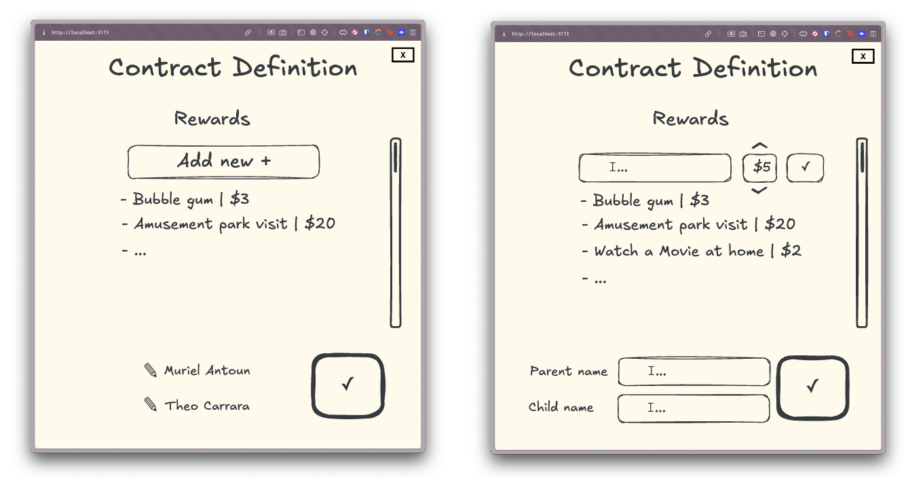

# Contract Feature
## **Story**

As a parent, I’d like to be able to define how my child can spend the coins they earn through the game. 

## **Solution**

We are going to add 2 screens, one for editing a contract and another for previewing. Essentially, the user will be able to define their contract, save it and then print it. To print they will click a button and that will either open the print menu, or save it as a PDF. Whatever is easier.

When editing the contract, it’s just a regular UI for inputs and confirmation/saving. We’ll gather the information and save it in local storage.

For the preview and printing feature, we’ll use the information saved to render a contract more akin to a paper document. 

### **Feature Outline**

- Contract definition
- Contract preview
- Contract render

### **Contract definition**

Screen with a Form where the parent can define the rewards and how much they cost

Spec

- button to go back to preview canceling changes
- info icon button that leads to Info page
- Title
- Rewards list: a list with an add button at the top of the list, when clicked it becomes the reward add component.
    - Has a rewards title and an indicator of reward number/total like (3/7)
    - Component to add/edit reward to list: wide input on the left for description, square input with increment/decrement arrows for money amount, checkmark button to confirm
    - Rewards: each has an edit and delete button
        - Edit button brings the reward edit component with the reward descriptions and money prefilled
    - Maximum of 7 rewards can be defined: if limit is reached the add button is disabled and clicking it shows a popup saying the limit has been reached
- Parent name and Child name inputs
- Confirmation button to save the contract

### **Contract preview**

In the spending screen, the contract should be shown together with the coin spending button.

Spec

- Money spending component
    - shows how much money the child has
    - a slider to choose how much they wanna spend
    - a button to spend → make the spending satisfying and also clear so that they wouldn’t spend money acdidentally
- The contract preview
- A button to print the contract
- a button to edit the contract: takes user to contract definition screen

**Contract render**

Use the information gathered from the Contract Definition screen that is saved in local storage to render a paper contract. The contract should have a fun witchy style to it. It’s important we structure the html/canvas here so that it’ll print exactly the same as rendered. 

The names of parent and child, plus reward descriptions and amounts should come from the local storage data.

What the contract page should be like: 

- It should have a Title “Vertrag”
- A subtitle “Diese Dinge kann ich gegen Munzen eintasuchen:”
- The list of rewards, with their descriptions and coins required to purchase
- An image of the Witch
- Fields to be filled in with the user, that means they will have a label and a line for the user to write on
    - Date field
    - Signatures
        - Signature field for Parent: this will show the parent name as a label
        - Signature field for Child: this will show the child name as a label